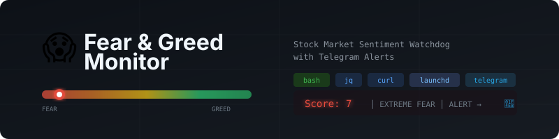

<p align="center">
  
</p>

<h1 align="center">😱 Fear & Greed Monitor</h1>
<p align="center">
  <strong>Automated Stock Market Sentiment Watchdog with Telegram Alerts</strong>
</p>

<p align="center">
  
  
  
  
  
  
</p>

---

## Overview

A lightweight, self-hosted market sentiment monitoring system that tracks the **CNN Fear & Greed Index** and pushes real-time Telegram alerts when the index enters **Extreme Fear** territory (score < 10). It also delivers a **daily summary at 9:35 PM SGT** — every day, regardless of the score — timed just after the US market opens.

Both schedules survive reboots: the LaunchAgents reload automatically whenever the machine is started again and run an immediate catch-up check. If the machine was off at 21:35, the daily summary is sent as soon as it's next started that day — once per day, never duplicated.

Built to run autonomously on a Mac Mini as part of a personal AI command centre, this project demonstrates practical data engineering: API data extraction, time-windowed scheduling, structured alerting, and fault-tolerant automation — all in a single zero-dependency shell script.

### Why This Matters

The Fear & Greed Index is a composite of 5 market indicators that captures investor sentiment on a 0–100 scale. Historically, scores below 10 have coincided with significant market dislocations — moments where disciplined investors find asymmetric buying opportunities. This tool ensures those moments are never missed, even at 2 AM.

---

## Architecture

```
┌─────────────────────────────────────────────────────────────┐
│  macOS LaunchAgents (auto-reload + run on every boot/login) │
│                                                             │
│  ① ALERT AGENT — every 30 min                               │
│  └── fear_greed_monitor.sh                                  │
│        │                                                    │
│        ├── 1. TIME GATE                                     │
│        │   └── Check if current SGT time is within          │
│        │       21:00–04:30 (US market hours overlap)        │
│        │       → Skip + log if outside window               │
│        │                                                    │
│        ├── 2. DATA EXTRACTION                               │
│        │   └── GET CNN F&G API (official gauge data);       │
│        │       falls back to feargreedchart.com mirror      │
│        │       → Parse composite score via jq               │
│        │       → Extract 5 component scores + weights       │
│        │                                                    │
│        ├── 3. THRESHOLD ENGINE                              │
│        │   └── Score < 10? → trigger alert pipeline         │
│        │       → 2-hour cooldown prevents alert fatigue     │
│        │                                                    │
│        ├── 4. ALERT DELIVERY                                │
│        │   └── POST to Telegram Bot API (JSON payload)      │
│        │       → Formatted message with full breakdown      │
│        │       → Delivery confirmation + error handling     │
│        │                                                    │
│        └── 5. OBSERVABILITY                                 │
│            └── Append structured log to ~/logs/             │
│                → Every run logged: SKIP | FETCH | SCORE |   │
│                   ALERT | SENT | ERROR                      │
│                                                             │
│  ② DAILY AGENT — every day at 9:35 PM SGT                   │
│  └── fear_greed_monitor.sh --daily                          │
│        │                                                    │
│        ├── 1. ONCE-PER-DAY GATE                             │
│        │   └── Skip if before 21:35 SGT or already sent     │
│        │       today (state file survives reboots)          │
│        │                                                    │
│        ├── 2. DATA EXTRACTION                               │
│        │   └── F&G score (same pipeline as above), plus:    │
│        │       S&P500 / Nasdaq / HSI / BTC (Yahoo Finance), │
│        │       US Fed rate, CPI YoY, unemployment (FRED),   │
│        │       top-3 headlines (CNBC RSS) — all best-effort │
│        │                                                    │
│        └── 3. UNCONDITIONAL DELIVERY                        │
│            └── Telegram summary sent regardless of score    │
│                → RunAtLoad catches up a send missed while   │
│                   the machine was powered off               │
└─────────────────────────────────────────────────────────────┘
```

---

## Fear & Greed Index Components

The composite score is derived from 5 equally-important market signals:

| Component | What It Measures | Fear Signal |
|-----------|-----------------|-------------|
| **Market Volatility (VIX)** | S&P 500 implied volatility | VIX spikes above historical avg |
| **Market Momentum** | S&P 500 vs 125-day moving avg | Price below moving average |
| **Put/Call Ratio** | Options market hedging activity | High put buying = defensive |
| **Safe Haven Demand** | Bond vs stock relative returns | Flight to treasury bonds |
| **Junk Bond Appetite** | Spread between junk & investment grade | Widening spreads = risk off |

Each component scores 0–100. The weighted composite produces the final index value:

| Score Range | Label | Interpretation |
|-------------|-------|----------------|
| 0–10 | **Extreme Fear** 🔴 | Potential capitulation — alert triggers |
| 11–20 | Extreme Fear | Significant pessimism |
| 21–40 | Fear | Below-average sentiment |
| 41–60 | Neutral | Balanced sentiment |
| 61–80 | Greed | Above-average optimism |
| 81–100 | Extreme Greed | Potential euphoria |

---

## Sample Telegram Messages

Every day at 9:35 PM SGT, regardless of the score:

```
📊 Daily Fear & Greed Update

📈 Fear & Greed Index: 33 (Fear)
📅 2026-07-29, 21:35 SGT

📉 Index:
  • S&P500: 6,365 (🔴 -0.3%)
  • Nasdaq: 21,098 (🟢 +0.2%)
  • HSI: 25,524 (🟢 +0.7%)
  • Bitcoin: 118,024 (🔴 -1.2%)
  • Interest Rate: 4.25% (last: 4.33% (as of 1/6/2026))
  • CPI: 2.6% (last: 2.4% (as of 1/6/2026))
  • Unemployment Rate: 4.2% (last: 4.1% (as of 1/6/2026))
  • Top 3 breaking news:
      • China unveils new chip breakthrough, rattling US tech stocks (29/7/2026 21:12 SGT)
      • Fed holds rates steady as inflation cools & markets rally (29/7/2026 18:05 SGT)
      • Bitcoin slips below $120K after record ETF inflows pause (29/7/2026 06:47 SGT)
```

Market data sources (all free, no API keys): index and Bitcoin quotes from
Yahoo Finance (price + day-over-day change). Interest Rate, CPI, and
Unemployment Rate are **United States monthly series** from FRED public CSVs —
Effective Federal Funds Rate (`FEDFUNDS`), CPI year-over-year computed from
`CPIAUCSL`, and civilian unemployment rate (`UNRATE`) — each shown as the
latest monthly value with the previous month's reading and its as-of date.
Headlines come from the CNBC Top News RSS feed, each with its publish
datetime converted to SGT. The Fear & Greed score itself comes from CNN's
official API — the same number as the gauge on cnn.com — with the
feargreedchart.com mirror as fallback. Every line is best-effort —
if a source is down it shows `n/a` and the summary is still delivered.

When the index drops below the threshold, the bot delivers this message:

```
🚨 EXTREME FEAR ALERT 🚨

📊 Fear & Greed Index: 7 (Extreme Fear)
🕐 Checked at: 22:30 SGT

📉 Component Breakdown:
  • Market Momentum (S&P500): 5/100 (extreme fear)
  • Stock Price Strength: 9/100 (extreme fear)
  • Stock Price Breadth: 8/100 (extreme fear)
  • Put/Call Options: 6/100 (extreme fear)
  • Market Volatility (VIX): 4/100 (extreme fear)
  • Junk Bond Demand: 11/100 (extreme fear)
  • Safe Haven Demand: 7/100 (extreme fear)

⚠️ Index is below 10 — market in extreme fear territory.

Source: CNN
```

---

## Quick Start

### Prerequisites

- macOS (tested on Mac Mini M4, Sonoma/Sequoia)
- [Homebrew](https://brew.sh) installed
- `jq` (`brew install jq`)
- A [Telegram Bot](https://core.telegram.org/bots#how-do-i-create-a-bot) + your chat ID

### Installation

```bash
# 1. Clone
git clone https://github.com/moltgoldfallen-droid/fear-greed-monitor.git
cd fear-greed-monitor

# 2. Configure — edit your Telegram credentials
nano fear_greed_monitor.sh
# → Replace TELEGRAM_BOT_TOKEN and TELEGRAM_CHAT_ID

# 3. Install (sets permissions, installs LaunchAgent, tests API)
chmod +x install.sh
./install.sh
```

### Manual Test Run

```bash
# Force a test alert (temporarily sets threshold to 99)
sed -i '' 's/THRESHOLD=10/THRESHOLD=99/' fear_greed_monitor.sh
sed -i '' 's/IN_WINDOW=false/IN_WINDOW=true/' fear_greed_monitor.sh
bash fear_greed_monitor.sh

# Check if Telegram received the alert, then revert
sed -i '' 's/THRESHOLD=99/THRESHOLD=10/' fear_greed_monitor.sh
sed -i '' 's/IN_WINDOW=true/IN_WINDOW=false/' fear_greed_monitor.sh
```

---

## Configuration

All parameters are at the top of `fear_greed_monitor.sh`:

| Parameter | Default | Description |
|-----------|---------|-------------|
| `THRESHOLD` | `10` | Alert when score drops below this value |
| `TELEGRAM_BOT_TOKEN` | — | Your Telegram bot token from @BotFather |
| `TELEGRAM_CHAT_ID` | — | Your Telegram chat ID from @userinfobot |
| `WINDOW_START` | `21` | Monitoring window start (SGT, 24h format) |
| `WINDOW_END_HOUR` | `4` | Monitoring window end hour (SGT) |
| `WINDOW_END_MIN` | `30` | Monitoring window end minute (SGT) |
| `DAILY_HOUR` | `9` | Daily summary send hour (SGT) |
| `DAILY_MIN` | `35` | Daily summary send minute (SGT) |
| `DAILY_STATE_FILE` | `~/.fear_greed_daily_last_sent` | Once-per-day marker (reboot-safe) |
| `COOLDOWN_MINUTES` | `120` | Minimum gap between consecutive alerts |
| `LOG_FILE` | `~/logs/fear_greed.log` | Log file location |

> **Note on the daily schedule:** the daily agent's `StartCalendarInterval` fires
> at 21:35 in the Mac's *system* timezone — keep the machine on `Asia/Singapore`.
> The script itself always evaluates its gates in SGT, so a mis-set system clock
> can delay the summary but never duplicate it.

---

## Project Structure

```
fear-greed-monitor/
├── README.md                                  # This file
├── fear_greed_monitor.sh                      # Core monitoring script (alert + daily modes)
├── com.eightday.fear-greed-monitor.plist       # LaunchAgent: alert mode, every 30 min
├── com.eightday.fear-greed-daily.plist         # LaunchAgent: daily summary at 21:35 SGT
├── com.eightday.fear-greed-listener.plist      # LaunchAgent: 🔄 refresh-button listener
├── install.sh                                 # One-command installer
├── SKILL.md                                   # OpenClaw skill definition
├── .env.example                               # Template for credentials
├── .gitignore                                 # Prevents credential leaks
├── LICENSE                                    # MIT License
└── assets/
    └── banner.svg                             # GitHub banner image
```

---

## Log Format

Every execution produces a structured, parseable log entry:

```
[2026-04-27 22:30:15 SGT] FETCH — Calling API at 22:30 SGT
[2026-04-27 22:30:16 SGT] SCORE — 65 (Greed) | Threshold: <10
[2026-04-27 22:30:16 SGT] OK — Score 65 is above threshold 10. No alert needed.
```

```
[2026-04-27 23:00:12 SGT] FETCH — Calling API at 23:00 SGT
[2026-04-27 23:00:13 SGT] SCORE — 7 (Extreme Fear) | Threshold: <10
[2026-04-27 23:00:13 SGT] ALERT — Score 7 is below threshold 10. Sending Telegram alert.
[2026-04-27 23:00:14 SGT] SENT — Telegram alert delivered successfully
```

```
[2026-04-27 14:00:01 SGT] SKIP — Outside monitoring window (14:00 SGT). Window: 21:00–4:30
```

Log tags: `SKIP` · `FETCH` · `SCORE` · `OK` · `ALERT` · `SENT` · `COOLDOWN` · `ERROR` · `FAIL` · `DEBUG`

---

## Useful Commands

```bash
# View recent logs
tail -20 ~/logs/fear_greed.log

# Live-follow logs
tail -f ~/logs/fear_greed.log

# Check LaunchAgent status (should list both agents)
launchctl list | grep fear-greed

# Test the daily summary right now (ignores the send-time gate and the
# once-per-day guard, and does NOT count as today's send)
bash fear_greed_monitor.sh --daily --test

# On-demand refresh from Telegram: tap the 🔄 Refresh data button on any
# daily message, or send /refresh (or /now) to the bot — the listener
# agent replies with a freshly-fetched summary. Requires exclusive use
# of the bot's getUpdates (don't poll the same bot from another app).

# Trigger the daily summary manually (respects the gates — only sends
# after 21:35 SGT and at most once per day)
bash fear_greed_monitor.sh --daily

# Pause monitoring (both agents)
launchctl unload ~/Library/LaunchAgents/com.eightday.fear-greed-monitor.plist
launchctl unload ~/Library/LaunchAgents/com.eightday.fear-greed-daily.plist

# Resume monitoring (both agents)
launchctl load -w ~/Library/LaunchAgents/com.eightday.fear-greed-monitor.plist
launchctl load -w ~/Library/LaunchAgents/com.eightday.fear-greed-daily.plist

# Check current Fear & Greed score
curl -s "https://feargreedchart.com/api/?action=all" | jq '.score.score'
```

---

## Design Decisions

**Why bash over Python?** Zero dependencies beyond `curl` and `jq`, both preinstalled or trivially available on macOS. The script runs in <1 second, uses ~2MB of memory, and requires no virtual environment, package manager, or runtime. For a single-purpose cron job, simplicity wins.

**Why launchd over crontab?** `launchd` is Apple's native scheduler — it handles wake-from-sleep catch-up, proper environment variables, and structured logging out of the box. `cron` on macOS is a legacy compatibility layer.

**Why time-window gating inside the script?** The LaunchAgent fires every 30 minutes 24/7, but the script self-gates to 9PM–4:30AM SGT. This keeps the plist simple and makes the schedule trivially adjustable by editing two variables — no need to recalculate plist calendar intervals.

**Why JSON payload for Telegram?** Telegram's `-d` form encoding breaks on newlines, ampersands (`&` in "Fear & Greed"), and emoji byte sequences. `jq -n` builds a properly escaped JSON body that handles all edge cases.

**Why 2-hour cooldown?** The Fear & Greed Index updates once per trading day, not intraday. Without a cooldown, a score of 8 would trigger alerts every 30 minutes for 7.5 hours. The cooldown ensures one alert per significant reading.

**Why `RunAtLoad` + a state file for the daily summary?** `StartCalendarInterval` catches up missed runs after *sleep*, but not after a *shutdown*. `RunAtLoad` fires the daily agent on every boot/login, and the script's gate (send only at/after 21:35 SGT, only once per day) turns that into safe catch-up behavior. The marker lives in `$HOME` — not `/tmp`, which macOS wipes on reboot — so a restart can never cause a duplicate send.

---

## Roadmap

- [ ] **Google Sheets logging** — append each score to a spreadsheet for historical trend analysis
- [ ] **Multi-threshold tiers** — separate alerts for < 20 (Fear), < 10 (Extreme Fear), < 5 (Capitulation)
- [x] **Daily digest** — daily Telegram summary at 9:35 PM SGT regardless of score
- [ ] **Crypto F&G support** — add alternative.me crypto Fear & Greed as a parallel monitor
- [ ] **Grafana dashboard** — time-series visualization of historical scores
- [ ] **Linux/Docker support** — systemd timer + containerised version for cloud deployment

---

## Tech Stack

| Layer | Tool | Purpose |
|-------|------|---------|
| Language | Bash | Script execution |
| Data extraction | curl | HTTP API calls |
| JSON parsing | jq | Structured data extraction |
| Scheduling | macOS launchd | Cron-equivalent timer |
| Alerting | Telegram Bot API | Push notifications |
| Logging | Structured plaintext | Observability |

---

## Related Work

This project is part of **EightDay** — a personal AI command centre built on [OpenClaw](https://github.com/nichochar/open-claw) and local LLMs. Other components include automated portfolio screening, daily tech news digests, and habit tracking — all orchestrated through Telegram.

---

## License

MIT — see [LICENSE](LICENSE) for details.

---

<p align="center">
  Built with 🦞 by <a href="https://github.com/moltgoldfallen-droid">Keng</a>
</p>
